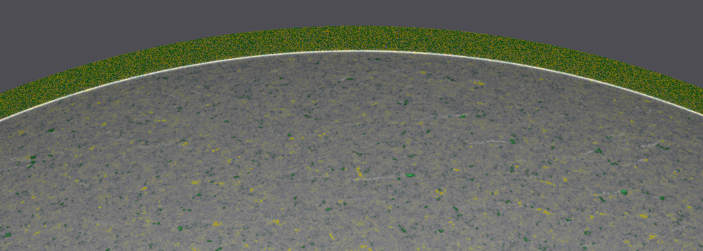

# Polar Faculae

## progressive_sd_movie.py

Calculates the progressive standard deviation of the intensity continuum data and overlays the instantaneous magnetogram for each timestamp. Outputs a PNG for each frame and an MP4 movie of the full day.

Change lines in the section labeled "CHANGE THESE LINES"
 - `date`: date, in format 'YYYYMMDD'
 - `folder_ic`: path to folder containing intensity continuum data
 - `folder_M`: path to folder containing magnetogram data
